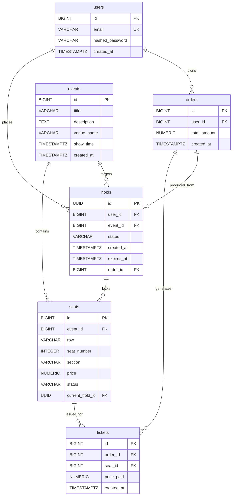

# Relational Data Model & Schema Specifications: Database Schema & Migrations

**Feature Branch**: `001-db-schema-migrations` | **Date**: 2026-09-25

## Database Entity Relationship Diagram

---

## Detailed Table Specifications

### 1. `users` Table
- `id`: `BIGINT`, Primary Key, Autoincrement.
- `email`: `VARCHAR(255)`, `NOT NULL`, Unique Index (`uq_users_email`).
- `hashed_password`: `VARCHAR(255)`, `NOT NULL`.
- `created_at`: `TIMESTAMPTZ`, `NOT NULL`, Default `NOW()`.

### 2. `events` Table
- `id`: `BIGINT`, Primary Key, Autoincrement.
- `title`: `VARCHAR(255)`, `NOT NULL`.
- `description`: `TEXT`, Nullable.
- `venue_name`: `VARCHAR(255)`, `NOT NULL`.
- `show_time`: `TIMESTAMPTZ`, `NOT NULL`.
- `created_at`: `TIMESTAMPTZ`, `NOT NULL`, Default `NOW()`.

### 3. `seats` Table
- `id`: `BIGINT`, Primary Key, Autoincrement.
- `event_id`: `BIGINT`, `NOT NULL`, Foreign Key -> `events(id)` ON DELETE CASCADE. Indexed (`idx_seats_event_id`).
- `row`: `VARCHAR(10)`, `NOT NULL` (e.g. `'A'`, `'B'`, `'C'`).
- `seat_number`: `INTEGER`, `NOT NULL` (row-scoped 1..10).
- `section`: `VARCHAR(50)`, `NOT NULL` (POC: `'A'`, `'B'`, `'C'`).
- `price`: `NUMERIC(10, 2)`, `NOT NULL`.
- `status`: `VARCHAR(20)`, `NOT NULL`, Default `'AVAILABLE'` (values: `'AVAILABLE'`, `'LOCKED'`, `'SOLD'`).
- `current_hold_id`: `UUID`, Nullable, Foreign Key -> `holds(id)` ON DELETE SET NULL. Indexed (`idx_seats_current_hold_id`).
- **Constraints**: Composite Unique Constraint `uq_seats_event_row_number` on `(event_id, row, seat_number)`.

### 4. `holds` Table
- `id`: `UUID`, Primary Key, Default `uuid_generate_v4()` / application UUID.
- `user_id`: `BIGINT`, `NOT NULL`, Foreign Key -> `users(id)` ON DELETE CASCADE.
- `event_id`: `BIGINT`, `NOT NULL`, Foreign Key -> `events(id)` ON DELETE CASCADE.
- `status`: `VARCHAR(20)`, `NOT NULL`, Default `'ACTIVE'` (values: `'ACTIVE'`, `'COMPLETED'`, `'EXPIRED'`).
- `created_at`: `TIMESTAMPTZ`, `NOT NULL`, Default `NOW()`.
- `expires_at`: `TIMESTAMPTZ`, `NOT NULL`. Indexed (`idx_holds_expires_at`).
- `order_id`: `BIGINT`, Nullable, Foreign Key -> `orders(id)` ON DELETE SET NULL. Indexed (`idx_holds_order_id`).

### 5. `orders` Table
- `id`: `BIGINT`, Primary Key, Autoincrement.
- `user_id`: `BIGINT`, `NOT NULL`, Foreign Key -> `users(id)` ON DELETE CASCADE.
- `total_amount`: `NUMERIC(10, 2)`, `NOT NULL`.
- `created_at`: `TIMESTAMPTZ`, `NOT NULL`, Default `NOW()`.
- **Note**: Carries **no** `hold_id` column. Link from order back to hold uses `WHERE holds.order_id = :order_id`.

### 6. `tickets` Table
- `id`: `BIGINT`, Primary Key, Autoincrement.
- `order_id`: `BIGINT`, `NOT NULL`, Foreign Key -> `orders(id)` ON DELETE CASCADE.
- `seat_id`: `BIGINT`, `NOT NULL`, Foreign Key -> `seats(id)` ON DELETE CASCADE.
- `price_paid`: `NUMERIC(10, 2)`, `NOT NULL`.
- `created_at`: `TIMESTAMPTZ`, `NOT NULL`, Default `NOW()`.
