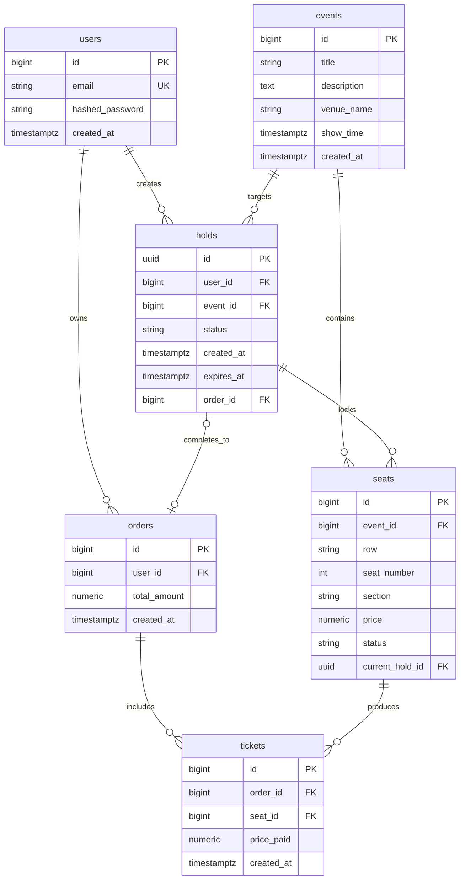

# Data Model & Domain Entity Specifications: Core Backend API (Ticketing)

**Feature**: `002-backend-api-ticketing` | **Date**: 2026-09-25

## 1. Domain Entities & Schema Definitions

---

## 2. Pydantic Schemas (Request / Response DTOs)

### Authentication DTOs
- `UserRegisterRequest`: `email: EmailStr`, `password: str` (min length 8)
- `UserLoginRequest`: `email: EmailStr`, `password: str`
- `TokenResponse`: `access_token: str`, `token_type: str = "bearer"`
- `UserResponse`: `id: int`, `email: str`, `created_at: datetime`

### Event & Seat DTOs
- `EventResponse`: `id: int`, `title: str`, `description: str | None`, `venue_name: str`, `show_time: datetime`, `created_at: datetime`
- `SeatResponse`: `id: int`, `event_id: int`, `row: str`, `seat_number: int`, `section: str`, `price: Decimal`, `status: str`, `current_hold_id: UUID | None`
- `SeatMapResponse`: `event_id: int`, `seats: list[SeatResponse]`

### Hold DTOs
- `HoldCreateRequest`: `seat_ids: list[int]` (min items 1, max items 10)
- `HoldResponse`: `hold_id: UUID`, `event_id: int`, `seat_ids: list[int]`, `status: str`, `created_at: datetime`, `expires_at: datetime`

### Checkout & Order DTOs
- `CheckoutRequest`: `payment_token: str = "mock_token_ok"`
- `TicketResponse`: `id: int`, `order_id: int`, `seat_id: int`, `price_paid: Decimal`, `created_at: datetime`
- `OrderResponse`: `id: int`, `user_id: int`, `total_amount: Decimal`, `created_at: datetime`, `tickets: list[TicketResponse]`

### AI Search DTOs
- `AISearchRequest`: `query: str`
- `AISearchResponse`: `quantity: int`, `adjacency: bool`, `max_price: Decimal | None`, `preferred_section: str | None`, `recommended_seat_ids: list[int]`

---

## 3. State Transitions

### Seat Status State Machine
- `AVAILABLE` $\rightarrow$ `LOCKED` (on hold acquisition)
- `LOCKED` $\rightarrow$ `SOLD` (on successful checkout)
- `LOCKED` $\rightarrow$ `AVAILABLE` (on lease sweeper expiration or explicit hold release)

### Hold Status State Machine
- `ACTIVE` $\rightarrow$ `COMPLETED` (on successful checkout; links to `order_id`)
- `ACTIVE` $\rightarrow$ `EXPIRED` (on lease sweeper execution, explicit release, or failed checkout)
