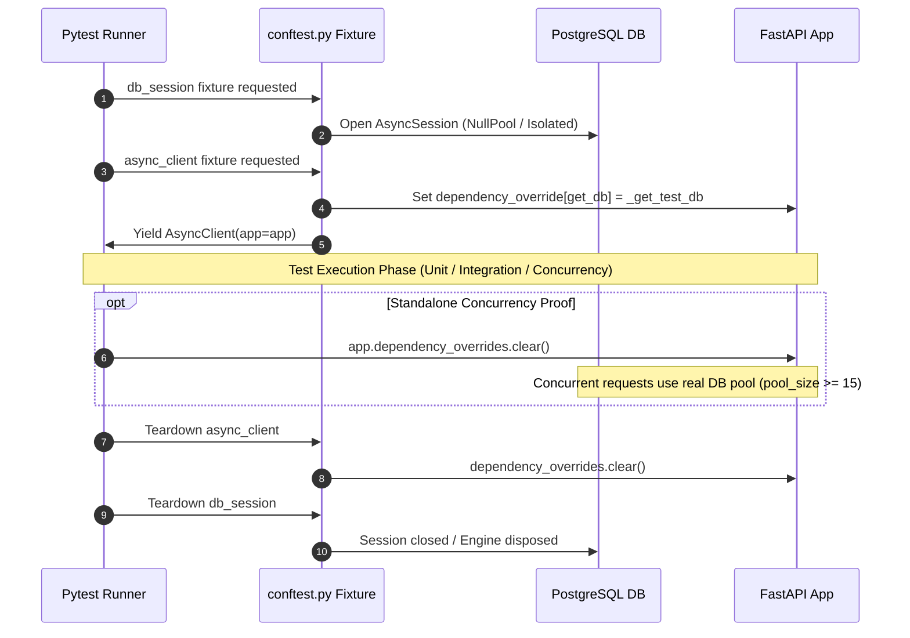

# Data Model & Schema Specification: Backend Test Suite

**Feature Branch**: `003-backend-test-suite`
**Date**: 2026-09-25

## 1. Concurrency Test Log Output Data Structure

The standalone concurrency test (`backend/tests/test_concurrency.py`) generates formatted, human-readable console log outputs. The structure of this output is defined below:

```text
================================================================================
                    FRONTROW CONCURRENCY COLLISION PROOF TEST                   
================================================================================
Target Seat ID      : 5
Initial Seat Status : AVAILABLE
Collision Scale     : 15 simultaneous HTTP requests
Timestamp           : 2026-09-25T20:15:00Z
--------------------------------------------------------------------------------

[SETUP PHASE]
  - Reset seat ID 5 to AVAILABLE status in PostgreSQL.
  - Generated 15 authenticated JWT user tokens.
  - Reset app dependency overrides to utilize real connection pool (pool_size >= 15).

[DISPATCH PHASE]
  - Firing 15 concurrent POST /api/v1/events/1/holds requests via asyncio.gather...
  - [Req 00] Fired at T+0.000s
  - [Req 01] Fired at T+0.000s
  ...
  - [Req 14] Fired at T+0.001s

[PER-REQUEST RESOLUTION PHASE]
  - [Req 00] -> HTTP 409 Conflict | Body: {"detail":"Seat row locking failed or contention detected"}
  - [Req 01] -> HTTP 201 Created  | Hold ID: c7b3e102-..., Expires: T+300s
  - [Req 02] -> HTTP 409 Conflict | Body: {"detail":"Seat row locking failed or contention detected"}
  ...
  - [Req 14] -> HTTP 409 Conflict | Body: {"detail":"Seat row locking failed or contention detected"}

================================================================================
                                SUMMARY RESULTS                                 
================================================================================
Total Collision Requests : 15
Successful Hold (201)    : 1  (Hold ID: c7b3e102-...)
Lock Contention (409)    : 14 (Row lock unavailable / NOWAIT exception caught)
Double-Selling Immunity  : VERIFIED (0 double-holds, 0 invalid statuses)
Post-Test Seat State     : LOCKED (current_hold_id = c7b3e102-...)
--------------------------------------------------------------------------------
[STATUS]: PASSED - Constitution Principle V Satisfied
================================================================================
```

## 2. Test Fixture Lifecycle Model



## 3. Test Track Data Classification

| Test Track | File Location | Database Dependency | Execution Speed Target | Primary Verification Objective |
| :--- | :--- | :--- | :--- | :--- |
| **Unit Track** | `tests/test_auth.py` | None / Mocked DB | < 1 second | JWT claim encoding/decoding, bcrypt password hashing, Pydantic 422 validation |
| **Integration Track** | `tests/test_events.py`<br>`tests/test_holds.py`<br>`tests/test_checkout.py`<br>`tests/test_sweeper.py` | Real Postgres (Alembic applied) | < 10 seconds | End-to-end hold creation, lazy expiration on read, atomic checkout, mock payment/refund stubs, lease sweeper (`SKIP LOCKED`) |
| **Concurrency Track** | `tests/test_concurrency.py` | Real Postgres (Pool $\ge 15$) | < 3 seconds | 15-request simultaneous collision proof, step-by-step console logging, zero double-selling |
