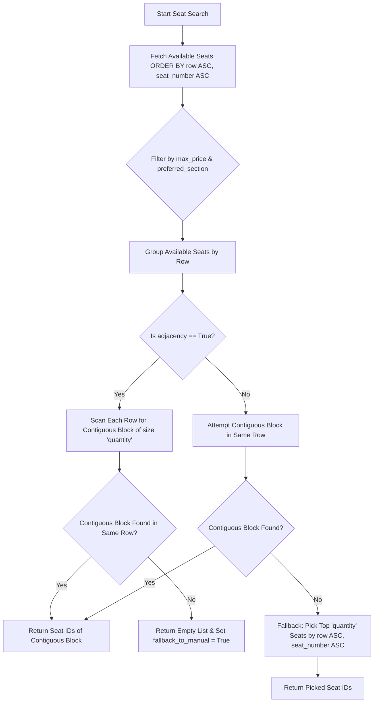
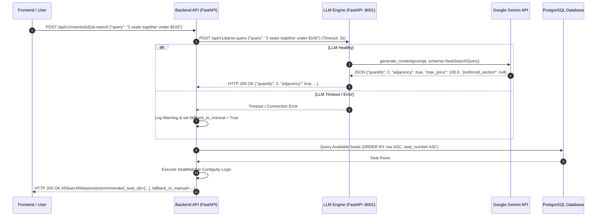

# Data Model & Schema Specification: LLM Engine Microservice

**Feature Branch**: `004-llm-engine-microservice`
**Date**: 2026-09-25

## 1. Pydantic DTO Schemas

### Microservice Request Payload (`ParseQueryRequest`)
```python
class ParseQueryRequest(BaseModel):
    query: str = Field(..., min_length=1, description="Natural language search query")
```

### Microservice Output Payload (`SeatSearchQuery`)
```python
class SeatSearchQuery(BaseModel):
    quantity: int = Field(default=1, ge=1, description="Number of tickets requested")
    adjacency: bool = Field(default=False, description="True if seats must be adjacent/together")
    max_price: Optional[float] = Field(default=None, description="Maximum price per ticket")
    preferred_section: Optional[str] = Field(default=None, description="Preferred seating section or row prefix")
```

### Backend API Search Response DTO (`AISearchResponse`)
```python
class AISearchResponse(BaseModel):
    quantity: int
    adjacency: bool
    max_price: Optional[float] = None
    preferred_section: Optional[str] = None
    recommended_seat_ids: List[int] = Field(default_factory=list)
    fallback_to_manual: bool = Field(default=False, description="True if manual seat map selection is recommended")
```

---

## 2. Row-as-Tier Contiguity Matching Flow



---

## 3. Microservice vs Backend Decoupling Architecture


