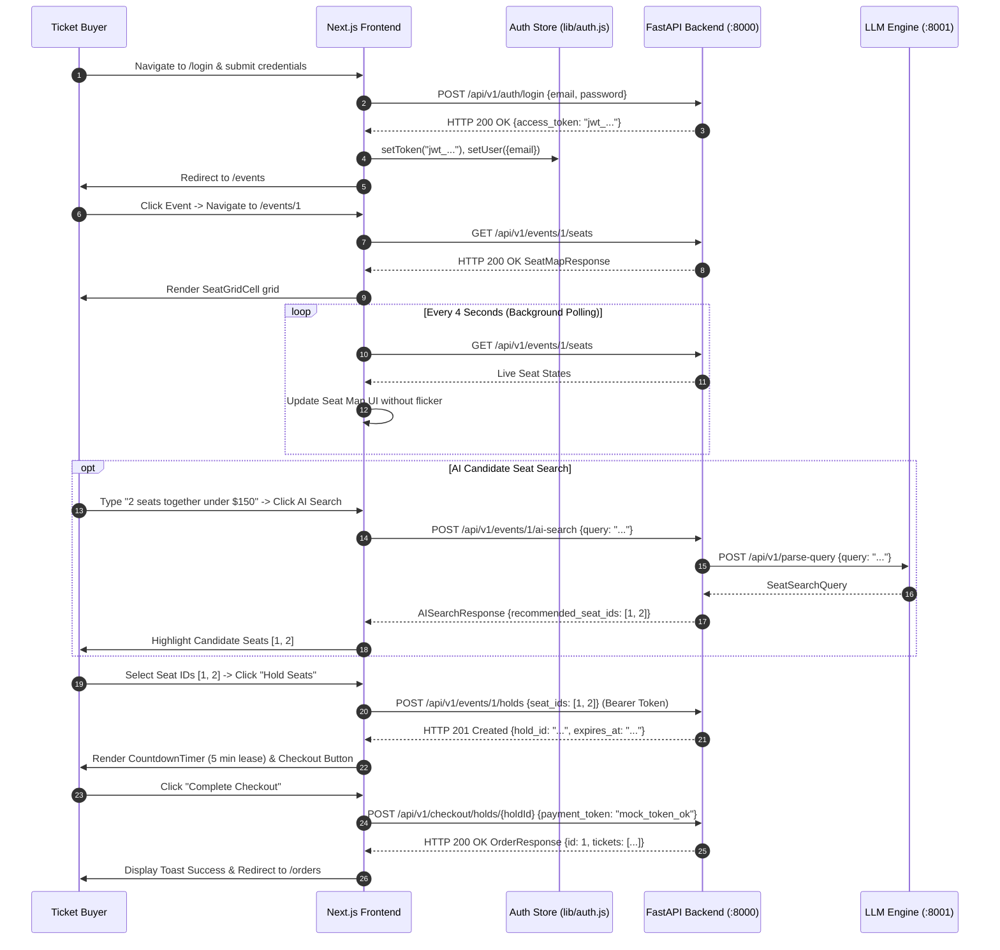

# Data Model & State Specification: Frontend User Flows

**Feature Branch**: `006-frontend-user-flows`
**Date**: 2026-09-25

## 1. Page State Models

### Seat Map Page State (`/events/[id]/page.js`)
```javascript
{
  event: { id: 1, title: "...", venue_name: "..." },
  seats: [
    { id: 1, row: "A", seat_number: 1, section: "A", price: "150.00", status: "AVAILABLE", current_hold_id: null },
    ...
  ],
  selectedSeatIds: [1, 2],
  activeHold: {
    hold_id: "c7b3e102-...",
    expires_at: "2026-09-25T20:40:00Z",
    seat_ids: [1, 2],
    status: "ACTIVE"
  },
  aiSearchQuery: "2 seats together under $150",
  toast: { message: "Hold acquired for 5 minutes!", type: "success" },
  loading: false,
  pollingActive: true
}
```

---

## 2. End-to-End User Flow Sequence


